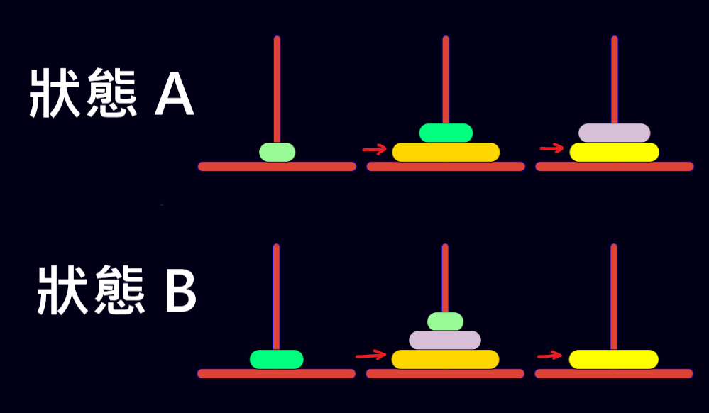
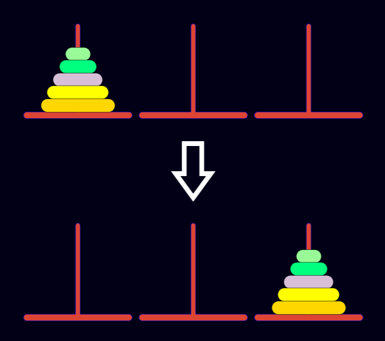
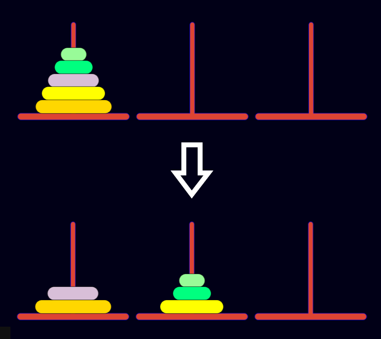
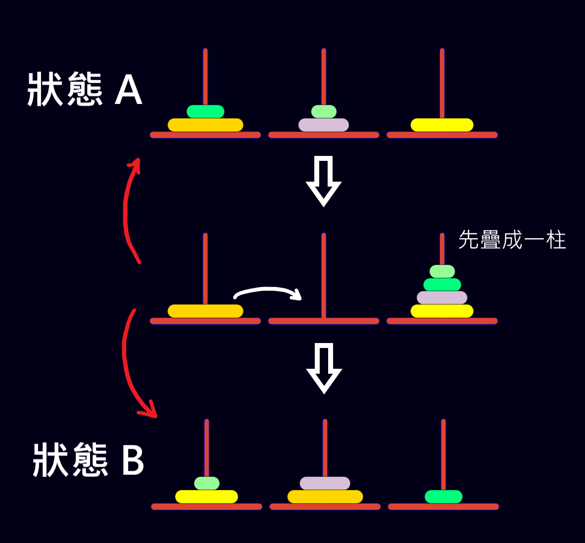

> 給一正整數 n，代表 河內塔 圓盤的數量<br>
再給兩個數組 A, B，代表 河內塔 圓盤狀態<br>
其中對於 $A_{i},\;B_{i}$<br>
$i$ 代表圓盤的大小（i 越大，圓盤需放在越下面）<br>
$A_{i},\;B_{i} = 1,\;2\;or\;3$ 代表圓盤所在的柱子<br>
求 **A 狀態** 至 **B 狀態** 的最少步驟數

***

## 解法一

### 🔹 A 狀態 至 B 狀態 的河內塔

#### 化簡

如下圖，可以發現<br>
**最大的圓盤** 跟 **第二大的圓盤** 從始至終都沒動過<br>
其他圓盤都比它們小（不會影響到其他圓盤移動）<br>
因此可以直接忽略



#### 考慮 全部在同一柱移至另外一柱 的步驟數

假設有 n 個圓盤，全部在 **第 a 柱**<br>
現在要把 n 個圓盤全部移至 **第 b 柱**



最少步驟數為 $2^{n} - 1$ 步

#### 考慮 全部都在一柱移至任意狀太 的步驟數

假設有 n 個圓盤，全部在 **第 k 柱**<br>
現在要把 n 個圓盤 移至 **A 狀態**<br>



計算最少步驟數的方法如下

判斷 **A 狀態** 最大圓盤 n 在不在 **第 k 柱**

**如果在：**<br>
用化簡原則直接忽略

**如果不在：**<br>
移動 n 上面的所有圓盤至另一柱（步驟數 $= 2^{n-1} - 1$）<br>再把 n 移到目標位置（步驟數 $= 1$）<br>
步驟數總和 $= 2^{n-1}$<br>
<font color="#ff2020">(記得從新計算 k)</font>

按此規則遍歷所有的圓盤

#### 起始與最終狀態調換，最少步驟數不變

**A 狀態** 至 **B 狀態** 的最少步驟數<br>
等於 **B 狀態** 至 **A 狀態** 的最少步驟數

### 🔹 拆解步驟

要讓 **A 狀態** 變成 **B 狀態**<br>
我們的步驟可以拆解成

**Step 1.** 化簡<br>
**Step 2.** 先把 最大的圓盤以外的圓盤 移至同一柱<br>
**Step 3.** 移動 最大的圓盤<br>
**Step 4.** 把同一柱 移至最終狀態

又根據 **起始與最終狀態可調換** 的性質<br>
Step 2. 可以反過來做<br>
也就是又變成了 **全部在同一柱 移至 任意狀太** 的步驟數



— — —

因此答案 = Step 2. + Step 3. + Step 4. 步驟數<br>
Step 3. 為移動大圓盤，步驟數 = 1<br>
Step 2.、Step 4. 實作 `cntStep()` 函數計算

### 🔹 Code 解釋

`cntStep(vector& a, int k, int idx)`<br>
用於計算 **全部在第 k 柱** 至 **A 狀態** 的最小步驟數<br>
`vector& a` 代表一個任意狀態<br>
`int k` 代表全部圓盤在第 k 柱<br>
`int idx` 代表只考慮 大小 < idx 的圓盤，（大於的被化簡掉了）

用右移 `1 << i` 來算 $2^{i}$<br>
另外需要注意 `i` = 0 ~ n-1<br>
所以計算 $2^{n-1}$ 直接用 `i` 即可，不能再 `-1`<br>

### ✅ 完整代碼

評分結果(參考) ： **<font color="#00bb00">AC</font> (1ms, 324KB)**

```cpp
#include<bits/stdc++.h>
#define int long long
using namespace std;

int cntStep(vector<int>& a, int k, int idx) {
    if(idx < 0) return 0;

    int step = 0;
    for(int i=idx; i>=0; i--){
        if(a[i] != k){
            step += (1LL << i);
            k = 6-a[i]-k;
        }
    }
    return step;
}

signed main(){
    ios::sync_with_stdio(false);
    cin.tie(nullptr);
    
    int n;
    while(true){
        cin >> n;
        if(n == 0) break;
        
        vector<int> a(n), b(n);
        for(int& i : a) cin >> i;
        for(int& i : b) cin >> i;
        
        int idx = n-1;
        while(idx>=0 && a[idx]==b[idx]){
            idx--;
        }
        int k = 6 - a[idx] - b[idx];
        
        cout << cntStep(a, k, idx-1) + 
                cntStep(b, k, idx-1) + 
                (idx>0 ? 1 : 0) << "\n";
    }
    
    return 0;
}
```

參考圖使用 <https://www.mathsisfun.com/games/towerofhanoi.html> 製作
